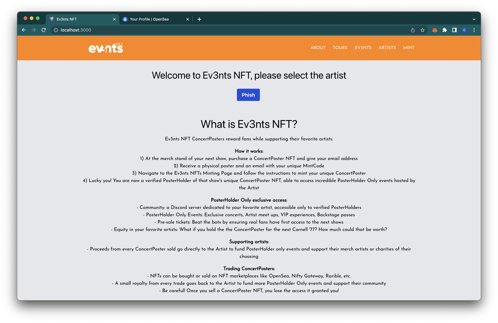
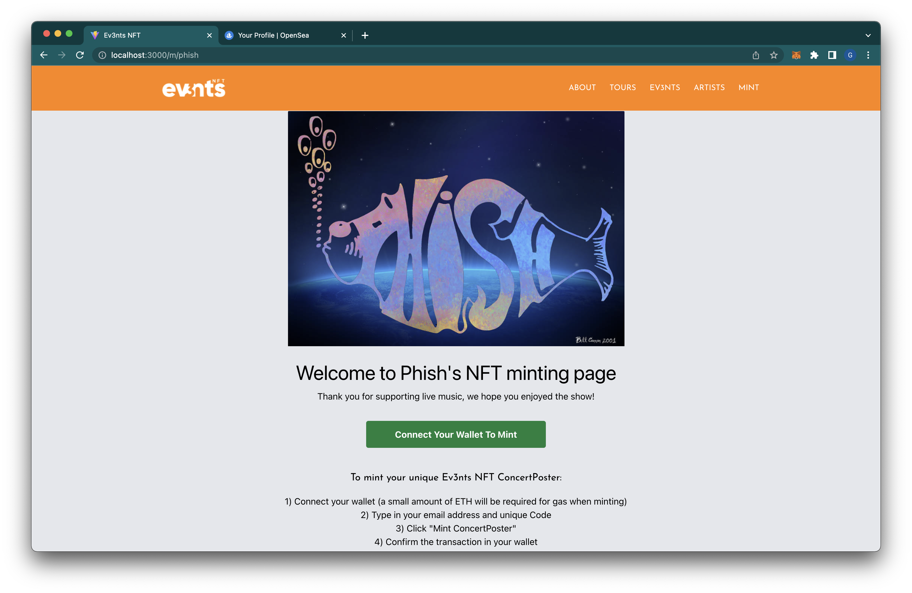
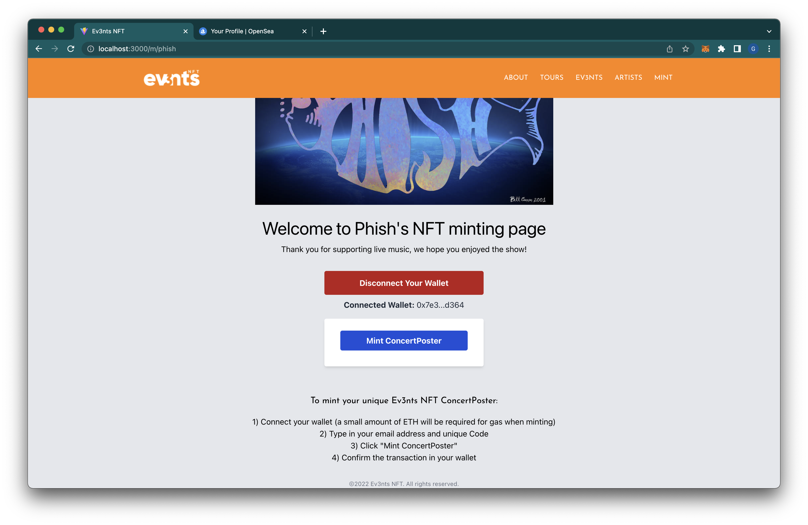

# Ev3nts NFT - See Music. Mint Posters. Get Rewards.

### Description

Ev3nts NFT ConcertPosters allow concert goers to bring home a digital piece of merchandise, rewarding fans with exclusive experiences for supporting their favorite artists.

---

## Technologies

This project leverages Solidity version 0.8.11 and the web version of the Remix IDE to build and test the smart contracts.

- [OpenZeppelin](https://github.com/OpenZeppelin/openzeppelin-contracts) - this is a library for secure smart contract development.

- [ERC-1155](https://docs.openzeppelin.com/contracts/3.x/erc1155) - this is a novel token standard that aims to take the best from previous standards to create a fungibility-agnostic and gas-efficient token contract.

- [ChainLink VRF](https://docs.chain.link/docs/chainlink-vrf/) - a verifiable random number generator (RNG) that generates random values and cryptographic proof on chain with compromising security.

- [MetaMask](https://metamask.io/) - this is a crypto wallet and gateway to blockchain apps.

- [NFT Storage](https://nft.storage/) - is a long-term storage service designed for off-chain NFT data (like metadata, images, and other assets)

- [IPFS](https://ipfs.io/) - A peer-to-peer hypermedia protocol designed to preserve and grow humanity's knowledge by making the web upgradeable, resilient, and more open.

- [OpenSea](https://opensea.io/) - A marketplace for NFTs to create, buy, sell, and auction.

- [React](https://reactjs.org/) - a JavaScript library for building user interfaces.

- [ethers.js](https://docs.ethers.io/v5/) - a library that aims to be a complete and compact library for interacting with the Ethereum Blockchain and its ecosystem.

- [Merkle_Tree](https://www.geeksforgeeks.org/introduction-to-merkle-tree/) - a tree like structure where every node on the tree represents a value that is the a result of a cryptographic hash function.

- [Keccak256](https://emn178.github.io/online-tools/keccak_256.html) - a library to compute a keccak hash in JavaScript.

- [Rinkeby Testnet](https://rinkeby.etherscan.io/address/0x2049dd922afa231500f8ea5aa9b0ddfeaa15c3b1) - The contract location on the Rinkeby Testnet.

---

## Installation Guide

The following libraries were installed for this project:

```
import "openzeppelin/contracts/access/Ownable.sol";
import "openzeppelin/contracts/token/ERC1155/IERC1155.sol";
import "chainlink/contracts/src/v0.8/VRFConsumerBase.sol";
import "openzeppelin/contracts/utils/Strings.sol";
import "openzeppelin/contracts/utils/cryptography/MerkleProof.sol";
```

---

## How Does It Work?

With their purchased ConcertPoster NFT from a concert, users can register their wallet and email directly at the site of concert venue. Then, they will receive instructions on adding their digital wallet to our whitelist. Finally, users can utilize our Ev3nts NFT website to mint their unique ConcertPoster NFT.

See screenshots below of Ev3nts NFT:

Ev3nts NFT intro page:


This is where users can connect your wallet:


This is where users can mint the NFT:


We utilized the ERC-1155 token to build our smart contract because it allows us to create a fungibility-agnostic and gas-efficient token contract. In other words, this allows artists to have unique ConcertPoster NFTs for each concert with multiple owners.

**What Does This Mean for Live Music?**

1. _Build community_ - Verified owners of a certain artists’ ConcertPoster (known as “PosterHolders”) gain exclusive membership to that artist’s or event’s Discord Server Community

2. _Grant exclusive access_ - We let the artists choose which events are right for their fans (PosterHolder only concerts, ticket pre-sales, meetups, etc.)

3. _Trade with royalties_ - Artists can choose their cut, receiving 2-10% of every subsequent peer-to-peer trade, going towards hosting PosterHolder Only events, paying merch and poster artists, or a charity they’re passionate about

4. _Allow fans to invest in artists_ - Owners reap the benefits as the fan-base grows and is willing to spend more and more for exclusive access. To promote collecting, artists can make specific experiences exclusive to PosterHolders of ConcertPosters from a certain year, tour, or venue or allow PosterHolders to vote on certain aspects of the community

---

## Conclusion

With our product,

- Artists are able to:
  - Reward your biggest fans with a more personal, community-driven experience
  - Raise more money for you, your merch artists, or any cause of your choosing
  - Solve the ticket bot crisis with PosterHolder Only pre-sales
- Fans are able to:
  - Build a stronger community
  - Access to exclusive events and perks
  - Purchase face-value tickets
  - Have the ability to invest in their favorite artists’ music career

---

## Contributors

Gabriel Alcivar - galcivar@galgomedia.com

Nico Cortese - nicolasacortese@gmail.com

Nadirah Durr - nadirahcodes@gmail.com

Yu Sun - sunyu92289@gmail.com

Heeje Yoo - heeje.yoo@pm.me

---

## License

The MIT License (MIT)
Copyright © 2022 <copyright holders>

Permission is hereby granted, free of charge, to any person obtaining a copy of this software and associated documentation files (the “Software”), to deal in the Software without restriction, including without limitation the rights to use, copy, modify, merge, publish, distribute, sublicense, and/or sell copies of the Software, and to permit persons to whom the Software is furnished to do so, subject to the following conditions:

The above copyright notice and this permission notice shall be included in all copies or substantial portions of the Software.

THE SOFTWARE IS PROVIDED “AS IS”, WITHOUT WARRANTY OF ANY KIND, EXPRESS OR IMPLIED, INCLUDING BUT NOT LIMITED TO THE WARRANTIES OF MERCHANTABILITY, FITNESS FOR A PARTICULAR PURPOSE AND NONINFRINGEMENT. IN NO EVENT SHALL THE AUTHORS OR COPYRIGHT HOLDERS BE LIABLE FOR ANY CLAIM, DAMAGES OR OTHER LIABILITY, WHETHER IN AN ACTION OF CONTRACT, TORT OR OTHERWISE, ARISING FROM, OUT OF OR IN CONNECTION WITH THE SOFTWARE OR THE USE OR OTHER DEALINGS IN THE SOFTWARE.
